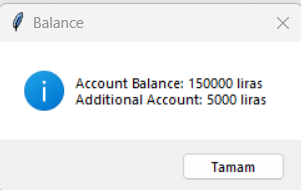

# MiniBank - A Simple ATM Simulation in Python

💳 MiniBank - A Simple ATM Simulation in Python

MiniBank is a simple ATM simulation built using Python and Tkinter. It allows users to perform basic banking operations like balance inquiry, withdrawals, deposits. This project is designed for educational and practice purposes.

##  Features

- User authentication (username & password)
- Balance inquiry
- Withdraw money (with additional account option if the main balance is insufficient)
- Deposit money
- Simple and intuitive GUI with Tkinter

## Screenshots

-  Login Screen:

-  Main Menu:

-  Balance Inquiry:

-  Withdraw Money:   

-  Deposit Money: 

## Technologies Used

- Python 
- Tkinter(for GUI)

## License

This project is for educational and practice purposes, and does not include any specific licensing.

